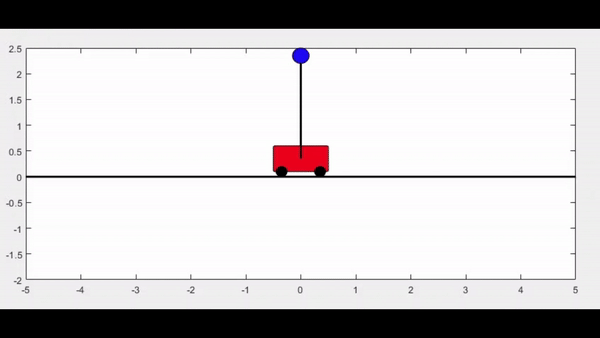

# Inverted-Pendulum-On-a-Cart
Without a controller, the inverted pendulum, starting with an initial angle slightly greater than π, will sway back and forth due to the pull of gravity. Over time, it will naturally come to a stop, slowed down by the effects of friction.

