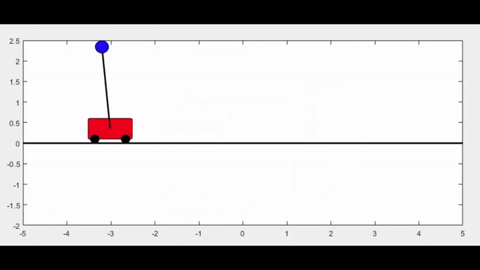

# Inverted-Pendulum-On-a-Cart
### No controller 
  Without a controller, the inverted pendulum, starting with an initial angle slightly greater than π, will sway back and forth due to the pull of gravity. Over time, it will naturally come to a stop, slowed down by the effects of friction.

### Pole Placement 
  By introducing controller input, we can control the pendulum on the cart to the desired target. This is achieved through the pole placement method, strategically placing all the eigenvalues in the left half-plane, ensuring system stability.
- Initial value [x=-3, x_dot=0, theta=pi+.1, theta_dot=0]'
- Desired value [x=1, x_dot=0, theta=pi, theta-dot=0]'

### Linear Quadratic Regulator (LQR) 
LQR is the sweet spot to find controller gain that aims to minimize a cost function that represents a trade-off between the control effort and the state of the system. It provides an optimal control law that minimizes a quadratic cost function. 

